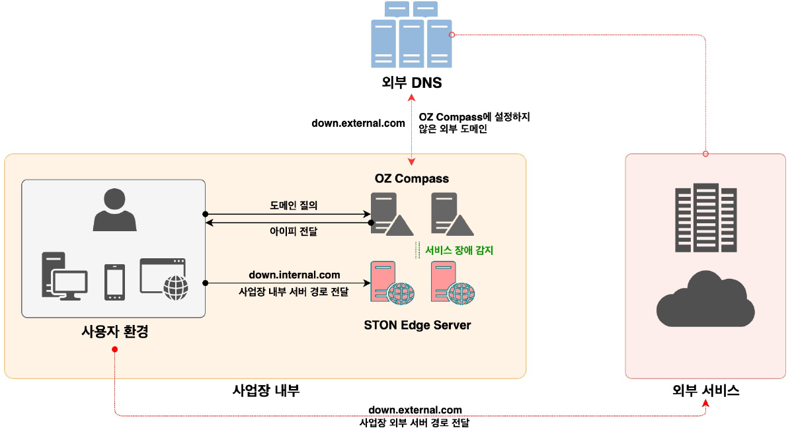

# OZ Compass

OZ Compass는 DNS 기반 트래픽 관리 및 부하 분산 소프트웨어 솔루션이다.

- 초기 설비 투자비용(CAPEX)없는 솔루션 도입
- 소프트웨어 솔루션으로 최적 운영 환경 지원
- 자유로운 트래픽 관리와 부하 분산
- 유연한 서비스 장애 대응
- 폐쇄적 환경에도 적용 가능한 유연한 모델
- 웹을 통한 손쉬운 관리 환경 제공
- 지속적인 업데이트 기능 제공

## 어떤 솔루션인가요?

**OZ Compass**는 자유로운 설치와 운영이 가능한 소프트웨어 타입의 엔터프라이즈급 Domain Name System (DNS)입니다. 이 솔루션은 Enduser가 인터넷 서비스 경로를 안내받을 수 있는 최적의 방법을 기업에 제공합니다. 웹 매니지먼트를 통해 도메인 설정과 아이피 정보를 손쉽게 관리할 수 있을 뿐만 아니라 서버와 인터넷 어플리케이션의 상태를 지속적으로 모니터링하며 기업 환경의 서비스 어플리케이션을 지속적이고 안정적으로 유지할 수 있도록 합니다.

**OZ Compass**는 사용자의 도메인 질의 요청을 서비스 어플리케이션에 할당된 아이피로 변환합니다. 예를 들어, 사용자는 브라우저나 어플리케이션에서 www.domain.com을 질의하면, 해당 인터넷 서비스에 할당된 아이피 정보인 192.0.0.1의 형식으로 변환하여 경로를 안내합니다. 서비스 환경에 따라 사용자가 안내 받는 아이피는 복수의 아이피가 될 수 있으며, 지속적으로 모니터링된 결과를 반영하여 사용자에게 최적의 경로로 안내합니다.

**OZ Compass**는 서비스 관리자들이 웹 매니지먼트를 통해 시각적으로 설정 가능하며, 모니터링 시스템과 연동할 수 있도록 실시간 모니터링 지표를 API를 다양한 운영 도구를 함께 제공합니다. 또한 범용적인 인터넷 서비스의 사용과 더불어, STON Edge Server와 호환 기능도 제공하여 더 효과적인 STON Edge Server 운영 환경도 함께 갖출 수 있습니다.

## 어떤 문제를 해결하나요?

- 지정된 서비스 도메인만을 가용 서버로 유도한다. 폐쇄적 네트워크 환경의 사업장에서는 사내 서비스의 성능 및 기능 개선을 위해 트래픽을 지정된 서버로 라우팅해야 한다.
- 사용자 트래픽을 최적의 경로로 안내한다. 서버 상태를 지속 감시하여 장애서버 배제, 가용서버 투입을 자동화할 뿐만 아니라 외부 데이터센터로 트래픽을 우회 시킨다.
- 사용자 어플리케이션 수정없이 서비스 개선이 가능하다. 사업장 내부 도메인 질의를 1차적으로 수행한다. 서비스하지 않는 도메인은 외부DNS 나 지정된 데이터 센터의 DNS를 참조하여 외부 질의를 수행한다.

## 일반 DNS와 차이점은?

- **복잡한 트래픽 부하 분산 기능 제공** - 서비스 환경에 따라 트래픽을 원하는 곳으로 라우팅한다.
- **웹 매니지먼트 제공으로 손쉬운 운영 환경** - 웹을 통해 운영자들이 손쉽게 서비스 관리와 설정이 가능하다.
- **소프트웨어 솔루션으로 전세계 어디든 설치 가능** - 어플라이언스가 아닌 소프트웨어로 유연한 설치 운영 환경을 제공한다.
- **서비스 상태의 실시간 감시 기능** - 서비스의 문제를 즉각적으로 반영하여 최적의 서비스 환경을 제공한다.
- **모니터링 API 제공으로 OZ Compass의 안정적인 운영 가능** - 실시간 상세 모니터링 지표 제공으로 안정적인 DNS 운영이 가능하다.
- **HA (High-Availability) 기능 제공** - Active OZ Compass에서 문제가 발생해도 Stand-by로 즉각 우회한다.
- **비용효율적인 DNS 운영 환경을 제공합니다.** - 초기 설비투자가 필요없이 사용량에 따라 비용을 지불한다.

