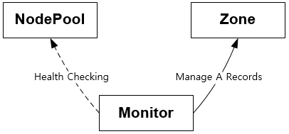
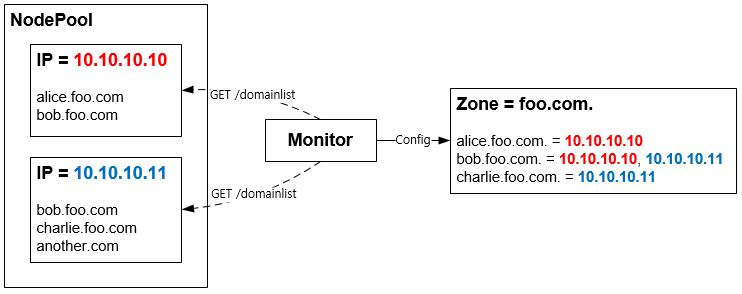

# Configuration

설정의 중요 구성요소는 Zone, NodePool, Monitor이다.

- **Zone** - 개별 도메인 서비스 구성이다.
- **NodePool** - 서버 집합으로 가용 자원풀을 의미한다.
- **Monitor** - NodePool의 Health Monitoring을 통해 Zone의 A Records를 구성한다.



기타 구성요소는 다음과 같다.

- **Forwarder** -  미등록 또는 장애 도메인 Query를 외부 DNS로 포워딩한다.
- **Replication** - HA(High Availability)를 위한 복제세트를 구성한다.


## 설정 구조

설정 파일 경로는 `/etc/compass/compass.conf` 이다. JSON형식이며 아래와 같은 구조를 가진다.

```xml
# /etc/compass.conf

{
  "Version: "2019-12-23",
  "NodePools" : [ ],
  "Zones" : [ ],
  "Monitors" : [ ],
  "Forwarders" : { },
  "Replication" : { }
}
```

- `Version` - 이 값은 반드시 `"2019-12-23"` 이어야 한다. 날짜를 버전으로 사용한다. 
- `Zones`, `Nodepools`, `Monitors` - 각 구성요소의 멀티 설정 (아래 상세설명)
- `Forwarders` - 포워딩할 외부 DNS 설정
- `Replication` - 복제 설정


## Zone

Zone을 통해 도메인 서비스를 구성한다. 하나의 Zone은 여러 개의 NodePool을 통해 서비스 제공이 가능하다.

```json
"Zones" : [
    {
        "Name" : "foo.com.",
		"Enabled" : true,
        "Description" : "static domains - foo.com.",
        "NameServers": ["ns1.foo.com.", "ns2.foo.com."],
        "DefaultTtl" : 30,
        "ForwardIfNoRecords": true,
        "ServiceRecordCount": 0,
        "Selector" : "random"
        "NodePools" : [ "firstPool", "secondPool" ]
	}
]
```

| 키                   | 설명                                | 기본 값  | 상속 |
| -------------------- | ----------------------------------- | -------- | ---- |
| `Name`               | 이름                                | (필수)   | X    |
| `Enabled`            | 활성화                              | true     | X    |
| `Description`        | 설명                                | (옵션)   | X    |
| `NameServers`        | 네임서버 목록                       | (필수)   | O    |
| `DefaultTtl`         | A Record TTL(초)                    | 30초     | O    |
| `ForwardIfNoRecords` | A Record 서비스 불가 시 포워딩 여부 | true     | O    |
| `ServiceRecordCount` | A Record 응답 개수                  | 0 (모두) | O    |
| `Selector`           | A Record 셀렉터                     | random   | O    |
| `NodePools`          | 사용할 NodePool 목록                | (옵션)   | O    |
| `Inherit`            | 설정을 상속할 부모 Zone             | (옵션)   | X    |
| `DynamicDomains`     | 동적 서브 도메인 바인딩             | false    | X    |

일반적인 Zone구성과 더불어 편리한 운영관리를 추가 기능( `Inherit`, `DynamicDomains`)을 제공한다. 다음 절에서 자세히 다룬다.


### Zone - 상속

앞서 구성한 foo.com의 서브 도메인들이 많을 경우 동일한 구성을 Copy & Paste 하는 것도 매우 번거로운 일이다. 이를 위해 상속`Inherit` 기능을 제공한다.

```JSON
"Zones" : [
    {
        "Name" : "foo.com.",
		... (생략) ...
	},{
        "Name" : "alice.foo.com.",
		"Inherit" : "foo.com"
	},{
        "Name" : "bob.foo.com.",
		"Inherit" : "foo.com"
	}
]
```

위와 같이 구성하면 alice.foo.com과 bob.foo.com은 foo.com의 설정을 상속 받는다. 예를 들어 foo.com의 `DefaultTtl` 의 값을 변경하면 상속받은 모든 Zone은 이 값을 사용한다. 상속받는 속성은 위 표를 참고한다.


### Zone - 동적 서브 도메인

`DynamicDomains`를 사용하면 미리 Zone 구성을 하지 않고 Web API를 통해 자동으로 서브 도메인 구성이 가능하다. 먼저 아래와 같이 베이스 도메인을 구성한다.

```
"Zones" : [
    {
        "Name" : "foo.com.",		
		"DynamicDomains" : true,
        ... (생략) ...
	}
]
```

`api-domain-list` 방식으로 동작하는 Monitor를 연결하면 서버들로부터 도메인 목록을 입력 받아 자동으로 Zone 구성한다. 다른 도메인(another.com)의 경우 무시된다.



`DynamicDomains`이 활성화된 Zone은 다른 Zone과 상속 관계를 맺을 수 없음을 주의한다.


## NodePool

NodePool은 동일한 목적을 가진 서버들의 집합을 가리킨다. 관리자는 NodePool 감시에 적합한 Monitor를 바인딩한다.

```json
"NodePools" : [
	{
        "Name" : "firstPool",
        "Description" : "this is the first pool",
        "LoadBalancingMode" : "RoundRobin",
        "MinimumMembers" : {
          "Enabled" : true,
          "Count" : 1,
          "Action" : "failover"
        },
        "Members" : [
          {
            "Enabled" : true,
            "Address" : "10.12.10.7"
          },
          {
            "Enabled" : true,
            "Address" : "10.12.10.8"
          }
        ],
        "Monitors" : [ "icmp" ]
    }, {
        "Name" : "secondPool",
        ... (생략) ...
    }    
],
```

| 키                 | 설명                                                         | 기본 값                                           |
| ------------------ | ------------------------------------------------------------ | ------------------------------------------------- |
| `Name`             | 이름                                                         | (필수)                                            |
| `Description`      | 설명                                                         | (옵션)                                            |
| `LoadBalacingMode` | 로드 밸런싱 모드                                             | RoundRobin                                        |
| `MinimumMembers`   | 최소 구성 멤버 설정<br />가용한 멤버 수가 `count` 미만인 경우 `action`을 수행한다. | Enabled: true<br />Count: 1<br />Action: failover |
| `Members`          | 구성 서버 목록                                               | Enabled: true<br />Address: (필수)                |
| `Monitors`         | (Health) 모니터                                              | (옵션)                                            |


## Monitor

(Health) Monitor는 NodePool에 소속된 `Members`의 가용여부를 감시한다. 프로토콜별로 `icmp`, `tcp`, `http`, `api-domain-list` 4종류의 Built-in 모니터를 제공한다.

```JSON
"Monitors" : [
    {
        "Name" : "icmp",
        "Protocol" : "icmp",
        "Description" : "built-in icmp monitor",
        "Interval" : 3,
        "TimeUntilUp" : 10,
        "Timeout" : 10
    },
    {
        "Name" : "tcp",
        "Protocol" : "tcp",
        "Port" : 80,
        "Description" : "built-in tcp monitor",
        "Interval" : 3,
        "TimeUntilUp" : 10,
        "Timeout" : 10
    },
    {
        "Name" : "http",
        "Protocol" : "http",
        "Port" : 80,
        "Secure" : false,
        "Description" : "built-in http monitor",
        "Interval" : 3,
        "TimeUntilUp" : 10,
        "Timeout" : 10,
        "Url" : "/",
        "Responses" : [ "200" ]
    },
    {
        "Name" : "api-domain-list",
        "Protocol" : "http",
        "Port" : 80,
        "Secure" : false,
        "Description" : "built-in api-domain-list monitor",
        "Interval" : 3,
        "TimeUntilUp" : 10,
        "Timeout" : 10,
        "Url" : "/domainlist",
        "Responses" : [ "200" ]
    }
]
```

| 키            | 설명                                                | 기본 값   |
| ------------- | --------------------------------------------------- | --------- |
| `Name`        | 이름                                                | (필수)    |
| `Protocol`    | 프로토콜                                            | (필수)    |
| `Port`        | 포트                                                | 80        |
| `Secure`      | 암호화 프로토콜 사용                                | false     |
| `Description` | 설명                                                | (옵션)    |
| `Interval`    | 모니터링 주기(초)                                   | 3초       |
| `TimeUntilUp` | 최초 모니터링 성공 이후 가용여부 판단 시간 (초)     | 10초      |
| `Timeout`     | 최초 모니터링 실패 이후 장애판단 시간 (초)          | 10초      |
| `Url`         | HTTP 기반 프로토콜에서 사용할 URL                   | /         |
| `Responses`   | HTTP 기반 프로토콜에서 정상응답으로 판단할 응답코드 | [ “200” ] |

